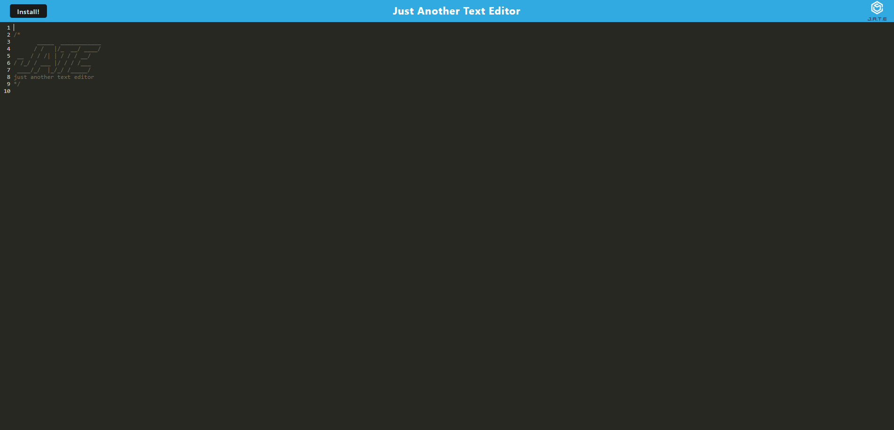

# Text-Editor

## Description

JATE, or Just Another Text Editor, is a fun app that allows you to play with editing whatever text you decide to input. Underneath the cool exterior, this app displays how I have learned how to create apps that show data persistence as well creating a web app that can be installed and used offline. Figuring out how to implement the things we learned in class for this project took a long time, and it was a great learning experience. There was a decent amount of research that needed to be done for the things we were asked to do. Despite seeming like a very simple assignment, it required more thought than I expected at first glance. 

## Table of Contents (Optional)

N/A

## Installation

N/A

## Usage

[Link to Deployed Heroku App](https://whispering-peak-46496-2d757bc95954.herokuapp.com/)

## Credits

Class content, documentation on the internet and tutor help from Sam Cordova
